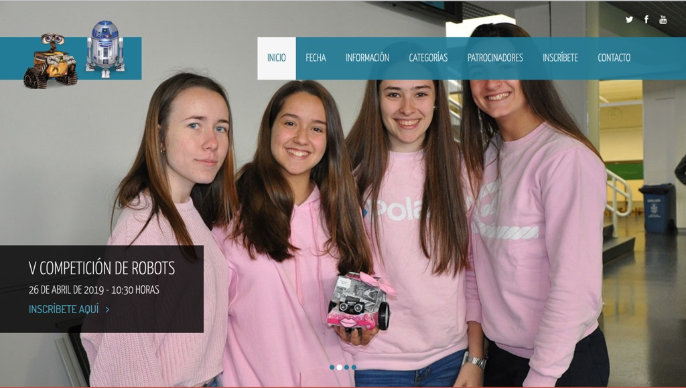
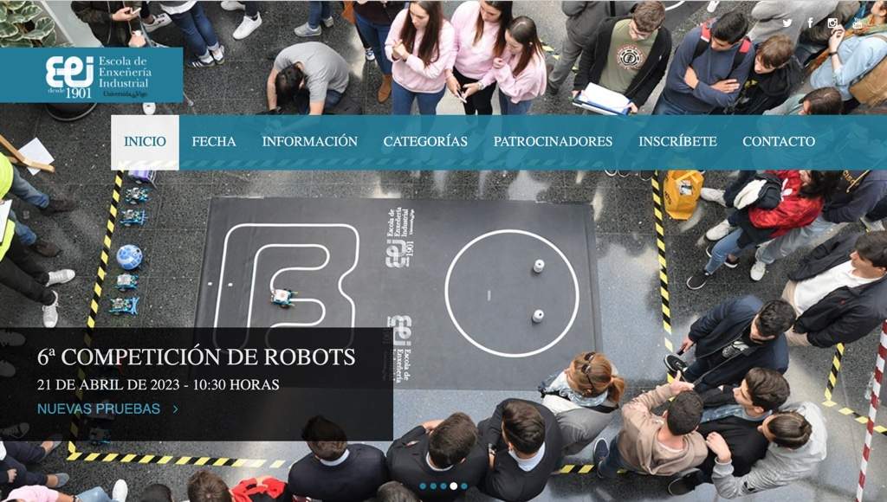
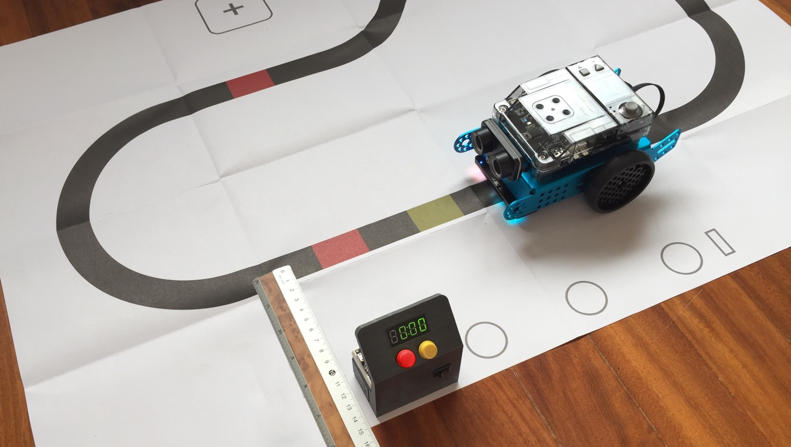
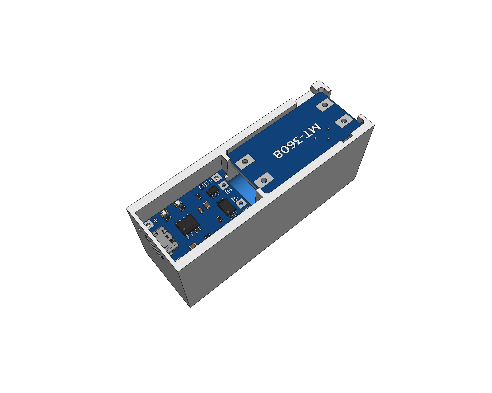
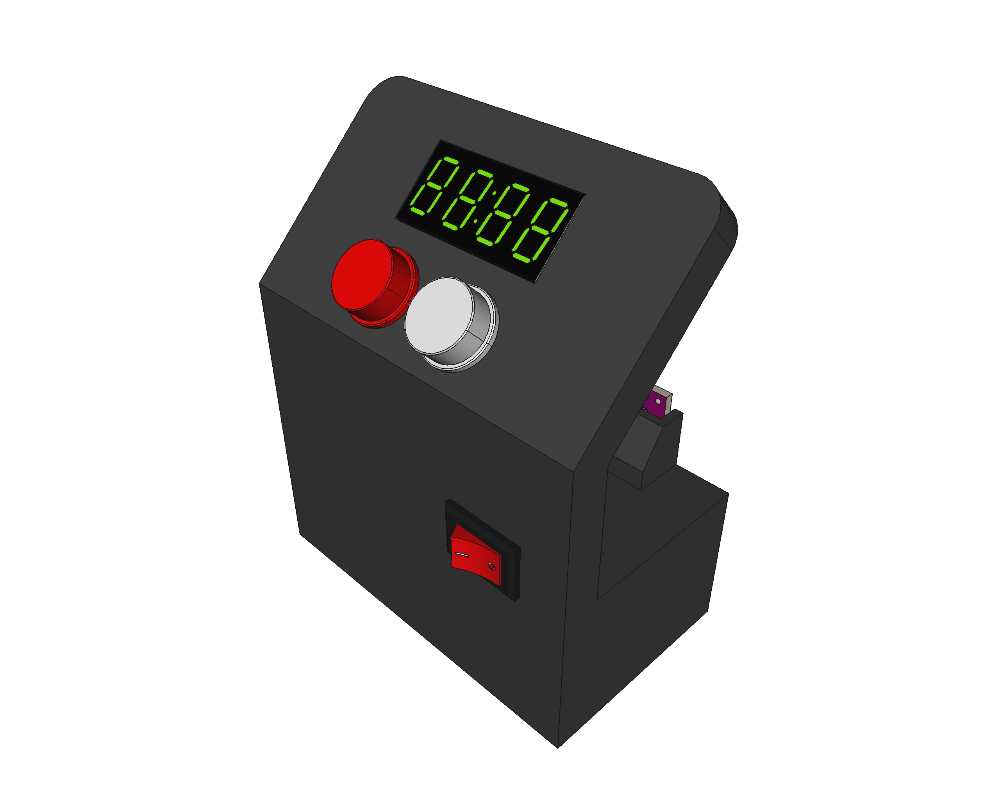
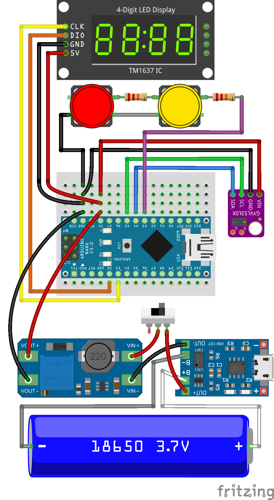

# EEI-Stopwatch
Open-source and open-hardware stopwatch for [UVigo's E.E.I. Robotic Competition](https://eei.robots.webs.uvigo.es/).

This project has been updated and improved for the **2023 VI edition** of the competition, including a new laser sensor (more accurate and less sensitive to interferences) and a new code base, making it easier to understand, use, configure and adapt.

It's been designed and executed with a minimalistic -yet **highly functional**- intention (it's NOT a toy) while preserving the ***tinkering & learning Maker mindset***, very appropiate and related to the competition nature and goals.

## HOW IT WORKS
The working principle of the **EEI-Stopwatch** is quite simple, although the logic becomes *tricky* easily:

* All the information is shown in a 4-digit 7-segment LED display (*output*).
* User actions are received via a two momentary buttons analog keypad (*input*).
* It has a Tof Laser sensor that measures the distance to the nearest object in front of it continuously.
* When this distance is bellow a configured value, i.e., when ***something passes in front of it***, a detection is triggered: `TDISTANCE` (20 cm by default).
* It gives some room for the object to pass completely to avoid repetitive triggering: `DCWINDOW` (1.9 s by default).
* It uses the internal clock of the microcontroller to measure times.
* It times up to as many laps as configured: `NUMLAPS` (4 by default).
* It shows temporarily the time for each lap after measuring it: `SLWINDOW` (2 s by default).

## OPERATION
The use of the **EEI-Stopwatch** is fairly straightforward and can be done mostly intuitively, but these are the detailed steps:

1. **Turn it ON** using the main frontal switch (position *1*): you should see a start-up animation (a *racing LED*). If any problem is detected, an error message will be shown, indicating that the device must be checked/serviced. Make sure also that it is correctly charged!
2. Once started, the EEI-Stopwatch is in ***Distance Measuring Mode***: it shows the distance -in centimeters- to the nearest object in front of the sensor.
	* Use this to **position it about 15-20 cm** from the *racing line*: use your own hand as reference for the sensor. Ideally, position it in the side of a straitgh line, perpendicular to it (like in the picture).
	* Once positioned, **clear all the objects** in front of it (to avoid *false triggers*) and **press the yellow button** to initiate the ***Stopwatch Mode***.
3. Once in the ***Stopwatch Mode***, the time won't start until it detects a *passing object* (anything at less than 20 cm): it's time to put the robot in the track -behind the stopwatch line- and start it (racing time!).
	* When the **robot is detected** (as passing in front of it), the stopwatch **starts measuring** the time, and does so until the robot is detected again, **storing the lap time** in that precise moment.
	* After each lap, the stopwatch **shows temporarily the previous lap time** (during 2 seconds) and then continues to show the current lap time, until the robot is detected again, repeating the process.
	* There are two possible options now: you can **wait until the robot completes all the laps** that the EEI-Stopwatch can measure in one go (4 by default), or you can **press the yellow button to abort** the process (discarding the current lap). In either case, the EEI-Stopwatch enters the ***Results Mode***.
4. In the ***Results Mode***, you can review all the lap times stored in this go: press the yellow button to cycle through them. Take into account that if the process was aborted, some of the laps may have a *0:00* time.
5. **RESET:** if you **long-press** the red button (during 1 second at least), the EEI-Stopwatch is reset, clearly showing it with a *RESET animation*, and entering the ***Stopwatch Mode*** again (step 3).

**CHARGING:** The EEI-Stopwatch is **battery-powered** (an 18650 Li-ion cell), and can be recharged using any typical 5V micro-USB mobile charger: plug it in the micro-USB connector of the case and watch how the status light changes (through the small hole by its side). NOTE: pay attention to not confuse the USB connector in the Arduino Nano with the one corresponding to the battery charger.

**RESOLUTION:** The EEI-Stopwatch has a configured **maximum resolution of ~5 hundredths** of a second (i.e. 50 ms), determined mostly by the Laser sensor, as the result of a balance between accuracy, interference resilience and responsiveness. It is more than good enough for our application, but feel free to read about it in the configuration section of the code and fine-tune it to your needs.

## 3D

All the **3D parts** (available in the [`3D`](3D) folder) were created using the open-source and free software [FreeCAD](https://www.freecad.org). You can find there also all the STL files ready to be sliced and 3D printed, with **no supports** required at all: it's a very easy print.

Before printing the pieces, make sure that the dimensions of the electronic parts match: tolerances of the 3D models are *quite tight* and I've already found modules with huge differences in size.

## ELECTRONICS

This is the schematic of the system, created using the open-source software [Fritzing](https://fritzing.org) and available in the [`electronics`](electronics) folder.

The bottom part is the **powerbank** subsystem that provides 5V to the device and is rechargable (using any *typical* 5V micro-USB mobile charger). The top part contains the **4-digit display**, the **ToF laser sensor** and the **analog keypad** (two buttons) along with the **main microcontroller** (an Arduino Nano).

## CODE

The EEI-Stopwatch is powered by an **Arduino Nano** which can be programmed with the [Arduino IDE](https://www.arduino.cc/en/software). The code is **thoroughly commented and documented**, and available in the [`code/chrono`](code/chrono) folder:

* There are a number of configuration parameters at the beggining of the `chrono.ino` file, if you wan't to fine-tune or adapt the operation to your needs (e.g. the number of laps to store, or the different clearing windows).
* Requires two external libraries: [TM1637TinyDisplay](https://github.com/jasonacox/TM1637TinyDisplay) and [VL53L0X](https://github.com/pololu/vl53l0x-arduino) (directly available within the Arduino IDE library manager).
* Includes also two local *ad-hoc* libraries: **`AKeypad-lib.h`** and **`Stopwatch.h`** (both *self-explanatory*)

## ASSEMBLY

In the [`assembly`](assembly) folder there is a 20 step guide to assemble the **EEI-Stopwatch**, including the powerbank itself.

**NOTE:** the assembly guide hasn't been updated to the latest 2023 revision but is still mostly relevant as only two things changed

* The IR sensor has been changed by a ToF Laser sensor
* Some of the connections have been updated accordingly (see the [new schematic](#electronics))

## REFERENCES

* UVigo's E.E.I. Robotic Competition: [eei.robots.webs.uvigo.es](https://eei.robots.webs.uvigo.es/)
* 4-digit 7-segment LED display library: [github.com/jasonacox/TM1637TinyDisplay](https://github.com/jasonacox/TM1637TinyDisplay)
* VL53L0X Tof Laser Sensor library: [github.com/pololu/vl53l0x-arduino](https://github.com/pololu/vl53l0x-arduino)
* VL53L0X ToF Laser Sensor datasheet: [www.digikey.com/en/datasheets/stmicroelectronics/stmicroelectronics-endm00279086](https://www.digikey.com/en/datasheets/stmicroelectronics/stmicroelectronics-endm00279086)
* My FreeCAD 3D models repository: [github.com/mgesteiro/FreeCAD-models](https://github.com/mgesteiro/FreeCAD-models)
* My Fritzing parts repository: [github.com/mgesteiro/fritzing-parts](https://github.com/mgesteiro/fritzing-parts)
* **FreeCAD** 3D CAD modelling software: [www.freecad.org](https://www.freecad.org)
* **Fritzing** schematics and PCB modelling software: [fritzing.org](https://fritzing.org)

## LICENSE

This work is licensed under the [GNU General Public License v3.0](LICENSE-GPLV30). All media and data files that are not source code are licensed under the [Creative Commons Attribution 4.0 BY-SA license](LICENSE-CCBYSA40).

More information about licenses in [Opensource licenses](https://opensource.org/licenses/) and [Creative Commons licenses](https://creativecommons.org/licenses/).
